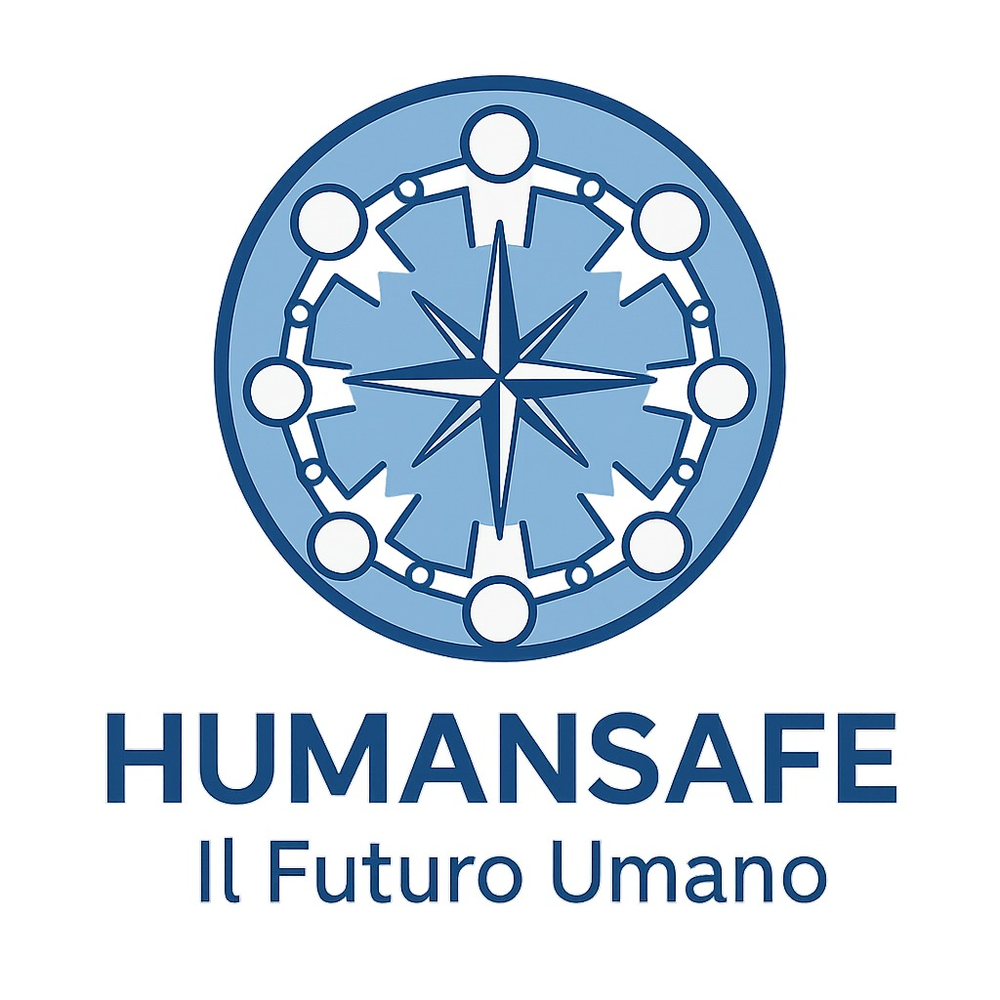

  

# 🛡️ HUMANSAFE CORE 
**Infrastruttura Etica e Framework Cognitivo per il Nuovo Umanesimo**
*Founder & Vision Architect: Messoud Sebbahi*

## 🌐 La Frattura del Nostro Tempo
Siamo la generazione tecnologicamente più connessa di sempre, eppure non siamo mai stati così isolati. **Humansafe** non è un semplice progetto teorico, ma un'infrastruttura operativa progettata per difendere l'essere umano dalla manipolazione algoritmica, ricostruire l'intelligenza emotiva e promuovere la responsabilità assoluta.

> *"L'umanità è un Organismo. Ogni individuo è una Cellula. Se la cellula si anestetizza, l'organismo si ammala. Se la cellula si risveglia, l'organismo guarisce."*

## 📂 Architettura del Repository

Questo repository costituisce il "Nodo Zero" dell'ecosistema Humansafe e contiene:

* 📁 `/docs` - I 6 Pilastri Legali, Etici e Operativi (Manifesto, Charter, B2B Standard, Framework, Public Report).
* 📁 `/core-algorithm` - La formula matematica alla base dell'**HUMANSAFE INDEX (HSI)** per il calcolo della tossicità vs sicurezza cognitiva.
* 📁 `/iself-smart-contract` - [WIP] Proof of Concept del Token di accountability su blockchain.
* 📁 `/interactive-simulation` - Il motore logico gamificato per l'analisi dei pattern mentali (Archetipi).

## 🧬 Il Metodo Humansafe (Peace Business)
Non monetizziamo la paura. Monetizziamo la prevenzione. 
Attraverso la nostra *Interactive Simulation*, testiamo il carico cognitivo degli utenti e delle aziende, misuriamo la loro dipendenza dalla dopamina digitale e offriamo micro-azioni per ripristinare la Sovranità Cognitiva. 

---
*Progetto ideato e sviluppato da [Messoud Sebbahi](https://github.com/meseb).*
